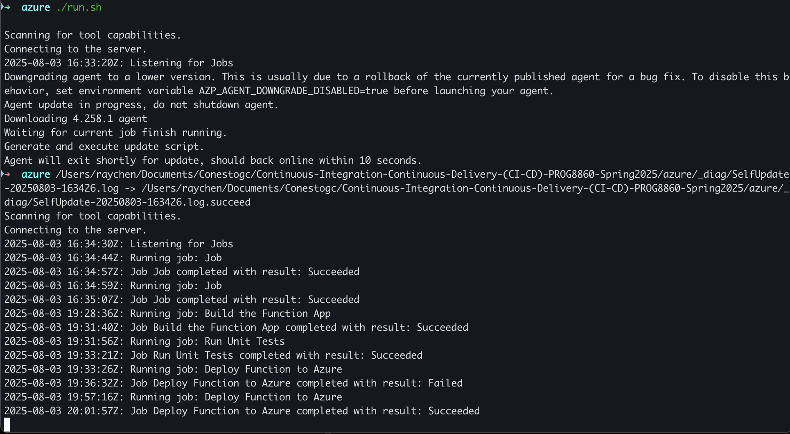
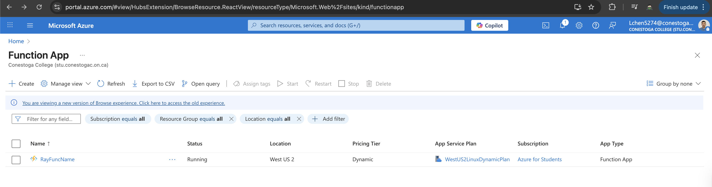
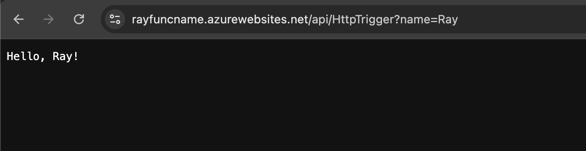
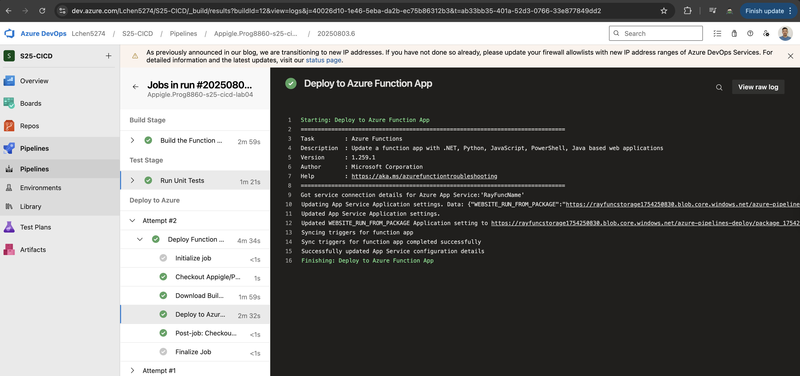

# Azure CI/CD Pipeline Project

## Project Summary

This project demonstrates the implementation of a complete Continuous Integration/Continuous Deployment (CI/CD) pipeline using Azure DevOps and Azure Functions. The pipeline includes three main stages: Build, Test, and Deploy, with successful deployment of a JavaScript Azure Function App.

## Architecture Overview

The solution utilizes:

- **Azure DevOps** for pipeline orchestration
- **Azure Functions** for serverless computing
- **GitHub** for source control
- **Self-hosted agents** for pipeline execution
- **Workload Identity Federation** for secure authentication

## Issues Resolved

### 1. Self-Hosted Pool Configuration



**Problem**: Limited permissions prevented access to Azure-hosted agents.
**Solution**: Configured a self-hosted pool (`SelfHostedPool`) to execute pipeline jobs on our own infrastructure, providing full control over the build environment.

### 2. Service Connection and Managed Identity Setup

**Problem**: Traditional service principal authentication required elevated permissions that were not available.
**Solution**: Implemented Workload Identity Federation using managed identity authentication, which provides secure access without requiring elevated permissions. Created service connection `AzureSubscription` with managed identity `AzureDevOpsManagedIdentity`.

### 3. Regional Deployment Constraints

**Problem**: Azure subscription policies restricted resource creation to specific regions only.
**Solution**: Updated all resources to use West US 2 region, which was included in the allowed regions list (westus3, westus2, canadacentral, mexicocentral, southcentralus).

### 4. Node.js Version Compatibility

**Problem**: Node.js 18 reached end-of-life on April 30, 2025, and was no longer supported for new deployments.
**Solution**: Updated to Node.js 22 LTS for both local development and Azure Function App runtime, ensuring long-term support and security updates.

### 5. Azure Function App Pre-creation Requirement



**Problem**: Pipeline deployment failed because the target Azure Function App did not exist.
**Solution**: Created the Azure Function App (`RayFuncName`) in Azure Portal before running the pipeline, ensuring the deployment target was available and properly configured.

### 6. Local Development Environment Setup

**Problem**: Missing essential tools for Azure Functions development and deployment.
**Solution**: Installed Azure CLI and Azure Functions Core Tools locally, enabling local development, testing, and deployment capabilities.

## Technical Implementation

### Pipeline Configuration

- **Trigger**: Main branch commits
- **Pool**: SelfHostedPool
- **Stages**: Build, Test, Deploy
- **Runtime**: Node.js 22 LTS on Linux

### Azure Resources

- **Function App**: RayFuncName
- **Resource Group**: AzureSubscription
- **Region**: West US 2
- **Storage Account**: rayfuncstorage1754250830
- **Runtime**: Node.js 22 LTS (Linux)

### Authentication

- **Service Connection**: AzureSubscription
- **Authentication Method**: Workload Identity Federation
- **Managed Identity**: AzureDevOpsManagedIdentity

## Final Results

### Deployed Function

The Azure Function App is successfully deployed and accessible at:
**Function API URL**: https://rayfuncname.azurewebsites.net/api/HttpTrigger



### Function Capabilities

- **HTTP Trigger**: Responds to GET and POST requests
- **Query Parameters**: Accepts `name` parameter for personalized responses
- **Response Format**: Returns "Hello, world!" or personalized greeting
- **Authentication**: Anonymous access enabled for testing

### Pipeline Success Metrics



- **Build Stage**: ✅ Successful compilation and packaging
- **Test Stage**: ✅ 4/4 unit tests passing
- **Deploy Stage**: ✅ Successful deployment to Azure Function App

## Local Development Setup

### Prerequisites

- Node.js 22 LTS
- Azure CLI
- Azure Functions Core Tools
- Git

### Installation Commands

```bash
# Install Azure CLI
brew install azure-cli

# Install Azure Functions Core Tools
npm install -g azure-functions-core-tools@4 --unsafe-perm true

# Login to Azure
az login
```

### Local Testing

```bash
# Run tests
npm test

# Start function locally
func start

# Test function
curl http://localhost:7071/api/HttpTrigger
```

## Project Structure

```
RayAZFuncApp/
├── src/functions/
│   └── HttpTrigger.js          # Main function code
├── tests/
│   └── HttpTrigger.test.js     # Unit tests
├── azure-pipelines.yml         # CI/CD pipeline configuration
├── package.json                # Dependencies and scripts
└── host.json                   # Azure Functions configuration
```
